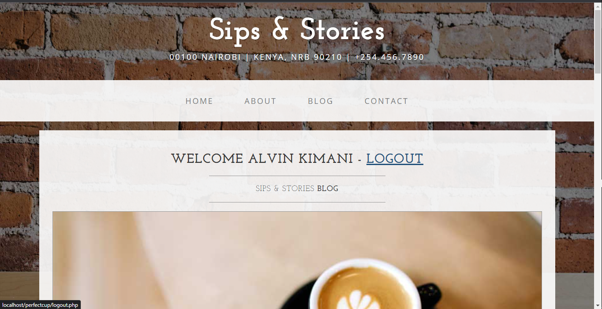

# [Sips & Stories](https://sips-and-stories.000webhostapp.com/index.php)

* This is a members-only blog website called (Sips & Stories) created using PHP and MySQL. It allows registered users to create, view, and comment on blog posts. Non-registered users can only view the posts but cannot create or comment on them.

## Getting Started

To use this theme, choose one of the following options to get started:
* Download the latest release on php
* Fork this repository on GitHub
### [git clone https://github.com/Gichbuoy/php-blog.git
]

## Requirements
To run this website, you will need the following:

* PHP (version 8 )
* MySQL (version 5.6 or higher)
* Web server (e.g., Apache, Xampp)
* Any modern web browser

### Installation
* Clone or download the repository to your local machine.
* Create a new MySQL database for the website.
* Import the provided SQL file (database.sql) into your newly created database. This will create the necessary tables.
* Update the database connection details in the config.php file with your database credentials.
* Upload the entire project directory to your web server.
* Ensure that the web server has the necessary permissions to read and write to the project directory.
* Open your web browser and access the website.

### Usage
* Open your web browser and enter the website URL.
* If you are a new user, click on the "Register" link to create an account. Provide the required information and submit the form.
* If you are a registered user, click on the "Login" link and enter your credentials to access your account.
* Once logged in, you can create blog posts, edit existing ones, comment on posts, and update your profile information.
* Administrators can access the admin panel by visiting /admin and logging in with their credentials. From the admin panel, they can manage users, blog posts, and comments.

## Bugs and Issues

Have a bug or an issue with this theme? [Open a new issue](https://github.com/Gichbuoy/php-blog/issues) here on GitHub.

## Copyright and License

Copyright 2023 This project is licensed under the MIT License. You are free to modify, distribute, and use the code for personal or commercial purposes.

